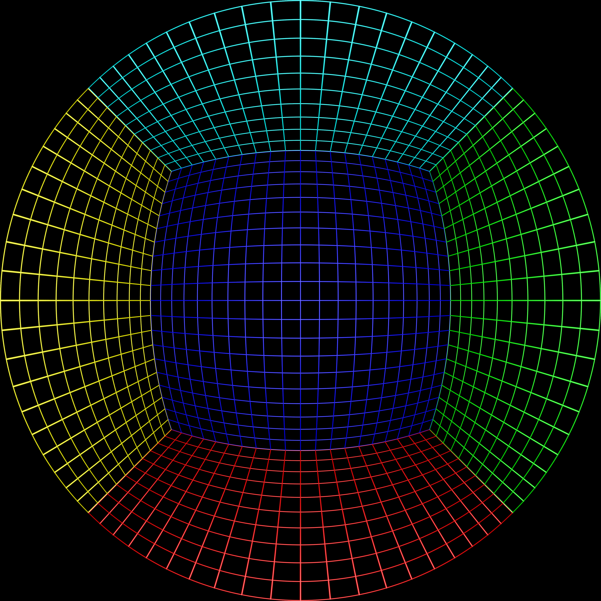
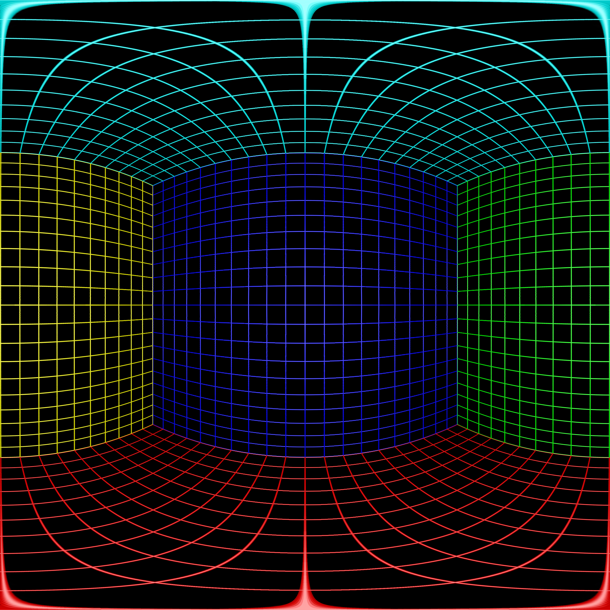

# Camera calibration (Gear 360)

Python tools to **fit lens and stitch parameters** from stills or video and write a **`calibration.toml`** that the **C++** (`cpp_player`) and **Python** (`python_player`) viewers can load.

- **`calib/`** — Main entrypoint `create_calibration.py` (image/video/preset/JSON → TOML), config helpers, and mask utilities.
- **`solvers/`** — Optimization backends (e.g. adjoint, plumbline, feature-based) and shared helpers like `tracking.py`.
- **`projections/`** — Fisheye → equirectangular / rectilinear reference code used in the pipeline.
- **`transformations/`** — Image geometry helpers (e.g. edge handling).

### Example projections (`images/`)

Single-lens fisheye input and the two **`projections/`** outputs. On disk: rectilinear uses `single_lens_rectilinear.png`; equirectangular uses `single_lens_equarectangular.png` (filename keeps the old “equarectangular” spelling).

If a preview still looks wrong after you swap or replace PNGs, reload the Markdown preview or restart the editor—many UIs cache image binaries by path. On GitHub, push the commit and hard-refresh the page (`Ctrl+F5`).

**Input (fisheye)** — `single_lens.png`

**Rectilinear** — `single_lens_rectilinear.png`

**Equirectangular** — `single_lens_equarectangular.png`

Quick start: from `calib/`, run `create_calibration.py` with `--help`, or see the module docstring at the top of `create_calibration.py` for examples and solver tuning paths under `solvers/configs/`.
